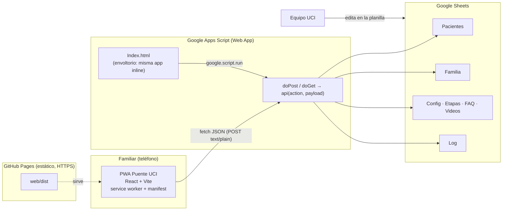

# Puente UCI — Diseño e intención

> Documento de definición del proyecto. Se escribió **antes** de programar y es la referencia
> para entender qué se construye, por qué y con qué límites.

## 1. Intención

**Puente UCI** es una aplicación para familiares de pacientes hospitalizados en una Unidad de
Cuidados Intensivos. Su propósito es doble:

1. **Acompañar a la familia**: explicar en lenguaje simple qué pasa en la UCI (etapas, procedimientos,
   alarmas, fin de vida, alta), responder preguntas frecuentes y entregar información práctica del
   servicio (horarios, útiles de aseo, contacto).
2. **Humanizar el cuidado**: recoger, de parte de la familia, quién es el paciente *más allá de su
   diagnóstico* (apodo, ocupación, gustos, música, familia, ayudas técnicas, un mensaje de la familia)
   y convertirlo en una **ficha humanizada imprimible** que se pega en la cabecera de la cama para que
   todo el equipo lo conozca como persona.

La versión 10 (`PuenteUCI_v10.jsx`) es un prototipo React de una sola pieza, sin persistencia:
todo vive en memoria y se pierde al recargar. Este proyecto la convierte en un producto usable:

- **Frontend PWA** (instalable en el teléfono, funciona sin conexión para el contenido educativo).
- **Google Apps Script** como capa de servidor (API JSON) y como *envoltorio* que también puede
  servir la app desde una URL de Google.
- **Google Sheets** como base de datos, para que el equipo clínico vea y edite los datos sin
  ninguna herramienta adicional.

## 2. Usuarios y escenarios

| Usuario | Qué hace | Dispositivo típico |
|---|---|---|
| Familiar directo | Completa el perfil humanizado, consulta contenido, imprime la ficha, vuelve varias veces al día | Teléfono, a veces sin buena señal en el hospital |
| Equipo UCI (enfermería, psicología, trabajo social) | Lee los perfiles en la planilla, actualiza la **etapa** del paciente, edita contenido (FAQ, horarios, consejo del día), imprime fichas | Computador de la unidad con cuenta Google |
| Administrador del proyecto | Despliega la app, gestiona la planilla y el script | Computador |

Escenario central: María llega a la UCI, escanea un código QR o abre un enlace, completa el perfil de
Carlos en 5 minutos, recibe un **código de acceso** para volver a entrar desde cualquier dispositivo,
y el equipo imprime la ficha desde la planilla o desde la app.

## 3. Decisión de arquitectura

### 3.1 La restricción que define el diseño

Google Apps Script sirve páginas web mediante `HtmlService` dentro de un *iframe* en un dominio
`*.googleusercontent.com` que cambia en cada carga. Esto tiene dos consecuencias duras:

- **No se puede registrar un service worker** (necesita un archivo JS servido desde el mismo origen
  con el tipo MIME correcto y una URL estable). Sin service worker no hay modo sin conexión ni
  "instalar app" real (`beforeinstallprompt` nunca se dispara dentro de un iframe de otro origen).
- El `manifest.webmanifest` tampoco se puede enlazar de forma válida desde ese iframe.

Por tanto **una PWA completa no puede vivir solo dentro de Apps Script**. La solución que cumple con
la intención ("PWA con envoltorio en Apps Script y Sheets como backend") es una arquitectura híbrida:

### 3.2 Arquitectura híbrida



- **Modo PWA (principal)**: la app estática se publica en GitHub Pages desde este mismo repositorio.
  Ahí sí hay service worker, manifest, instalación y caché sin conexión. La app habla con Apps Script
  por `fetch`.
- **Modo envoltorio (secundario)**: el mismo build se inyecta *inline* en `apps-script/Index.html`.
  Al desplegar el script como Web App, la app también funciona desde la URL `script.google.com/...`.
  Es útil como respaldo y para un despliegue restringido al dominio Google del hospital (el equipo
  entra con su cuenta institucional). En este modo el cliente usa `google.script.run` en vez de
  `fetch`; el código detecta el modo en tiempo de ejecución.
- **Un solo código fuente** para ambos modos. Un script (`scripts/build-gas.mjs`) genera el
  envoltorio a partir del build.

### 3.3 Por qué Sheets

- El equipo clínico ya sabe usar planillas: ver el perfil de un paciente, cambiar su etapa o
  corregir un horario no requiere una pantalla de administración.
- Costo cero, permisos de Google Workspace, historial de versiones incluido.
- Límite conocido y aceptado: es una base de datos para decenas o cientos de pacientes activos, no
  miles de usuarios concurrentes. Ver §8.

## 4. Estructura del repositorio

```
PUENTE/
├── docs/
│   ├── DISENO.md            ← este documento
│   ├── DESPLIEGUE.md        ← paso a paso: Sheets, Apps Script, GitHub Pages
│   └── original/PuenteUCI_v10.jsx  ← prototipo de referencia (sin modificar)
├── web/                     ← frontend PWA (Vite + React)
│   ├── index.html
│   ├── public/  manifest.webmanifest, sw.js, icons/
│   └── src/
│       ├── main.jsx         ← montaje + registro del service worker
│       ├── App.jsx          ← estado global, sesión, sincronización
│       ├── screens/         ← Onboarding, Home, Info, Journey, Videos, Faq, Profile, Eol, Post, Ficha
│       ├── components/      ← Logo, Icons, Modal, Toast, FamilyTree, ProfileSidebar
│       ├── lib/             ← api.js, storage.js, image.js, journey.js, profile.js
│       ├── data/            ← contenido por defecto y catálogos (chips, vínculos, emojis)
│       └── styles/app.css   ← estilos del prototipo + adiciones PWA
├── apps-script/             ← proyecto de Google Apps Script (se sube con clasp o copiando)
│   ├── appsscript.json
│   ├── Code.gs              ← doGet, doPost, dispatcher api()
│   ├── Sheets.gs            ← acceso a hojas, setupSpreadsheet(), códigos de acceso
│   ├── Content.gs           ← contenido semilla (FAQ, etapas, videos, config)
│   └── Index.html           ← envoltorio generado (no editar a mano)
├── scripts/build-gas.mjs    ← genera apps-script/Index.html desde web/dist
└── .github/workflows/deploy-pages.yml
```

## 5. Frontend

### 5.1 Módulos y estado

`App.jsx` conserva el modelo de estado del prototipo (`form`, `treeNodes`, `checklist`,
preferencias) y agrega:

| Estado | Contenido | Persistencia |
|---|---|---|
| `session` | `code`, `patientId`, `etapa`, `estado`, `updatedAt` | localStorage |
| `profile` | `form` + `treeNodes` + `checklist` + `prefs` | localStorage (caché) + Sheets |
| `content` | etapas, FAQ, videos, config | localStorage (caché) + Sheets, con valores por defecto empaquetados |
| `sync` | `online`, `pending` (hay cambios sin subir), `lastError` | memoria + flag en localStorage |

Flujo:

1. **Arranque**: lee sesión y perfil de localStorage. Si hay sesión, entra directo a la app y
   refresca perfil y contenido en segundo plano. Si no, muestra onboarding.
2. **Onboarding**: idéntico al prototipo. Se agrega "Ya tengo un código" para recuperar un perfil
   desde otro dispositivo. Al confirmar la tarjeta se llama `createProfile`; el paso final muestra el
   **código de acceso** con botón para copiar.
3. **Edición** (panel lateral): guarda local y llama `updateProfile`. Si falla o no hay conexión,
   marca `pending` y reintenta al recuperar conexión o al volver a abrir la app.
4. **Sin backend configurado** (`VITE_API_URL` vacío y no está en modo Apps Script): funciona en
   *modo local* con un aviso claro; nada se pierde al configurar el backend después porque el
   perfil local se puede subir con `createProfile`.

### 5.2 Modos de ejecución del cliente (`lib/api.js`)

```
if (window.google?.script?.run)   → modo envoltorio: google.script.run.api(req)
else if (API_URL)                  → modo PWA: fetch(API_URL, { method: 'POST',
                                     headers: { 'Content-Type': 'text/plain;charset=utf-8' },
                                     body: JSON.stringify(req), redirect: 'follow' })
else                               → modo local (sin red)
```

`text/plain` evita el *preflight* CORS, que Apps Script no responde. La URL viene de
`VITE_API_URL` al construir, o en tiempo de ejecución desde `window.PUENTE_CONFIG.apiUrl` o
`localStorage['puente.apiUrl']` (útil para probar sin reconstruir).

### 5.3 PWA

- `manifest.webmanifest`: nombre, colores de marca (`#03045E` / `#00B4D8`), `display: standalone`,
  iconos 192/512 y *maskable*.
- `sw.js` escrito a mano (sin dependencias):
  - **Precarga** del shell (`index.html`, manifest, iconos) en `install`.
  - **Navegaciones**: red primero, caché de respaldo (para abrir la app sin señal).
  - **Assets con hash** (`/assets/*`): caché primero (inmutables por nombre).
  - **API**: nunca se cachea; el modo sin conexión de los datos lo resuelve localStorage.
  - Versión inyectada en el build para invalidar cachés antiguas.
- Registro del service worker solo fuera del iframe de Apps Script.
- **iPhone / iPad**: Safari soporta service worker, manifest (`display: standalone`) y caché, pero no
  ofrece botón de instalación: la app muestra la instrucción Compartir → "Añadir a pantalla de inicio".
  Se incluye `apple-touch-icon.png` opaco de 180 px (iOS pinta de negro las esquinas transparentes),
  zonas seguras (`env(safe-area-inset-*)`) para la muesca y la barra inferior, altura `100dvh` y
  campos de 16 px para evitar el zoom automático al escribir. Safari borra el almacenamiento de un
  sitio tras 7 días sin visitarlo, salvo si está instalado en la pantalla de inicio; el código de
  acceso cubre ese caso. Las notificaciones push existen en iOS 16.4+ solo para apps instaladas y
  requieren un servicio intermedio (ver §8).

### 5.4 Cambios funcionales respecto al prototipo

- La **etapa** del paciente deja de estar fija en "Destete": viene de la planilla (`etapa` 1–4) y
  la actualiza el equipo. Aparece en Inicio, en el mapa del viaje y en la barra lateral.
- **Contenido editable** desde Sheets: FAQ, videos (con URL de YouTube), etapas, horario de visitas,
  sala, hora de informe médico, teléfono de contacto y consejo del día.
- **Fotos** del árbol familiar se reducen en el dispositivo (≈160 px, JPEG) antes de guardarlas,
  para caber en una celda y no cargar la planilla.
- **Catálogos unificados** de chips (música, deporte, cotidiano, social, ayudas técnicas): el
  prototipo usaba etiquetas distintas en el onboarding y en el panel lateral ("Música clásica" vs
  "Clásica"), lo que hacía que una misma selección apareciera desmarcada.
- Impresión en nueva ventana ahora incluye los estilos (en el prototipo salía sin formato).
- "Cerrar sesión" borra la caché local del dispositivo (importante en teléfonos compartidos).

## 6. Backend (Apps Script)

### 6.1 Despliegue

Web App con **Ejecutar como: yo** (dueño de la planilla) y **Acceso: cualquier persona**. Los
familiares no tienen cuenta Google; el script accede a la planilla con la identidad del dueño y
la familia nunca ve la planilla.

### 6.2 API

Todas las llamadas son `{ action, ...payload }` y responden `{ ok: true, data }` o
`{ ok: false, error }`.

| action | Entrada | Salida | Notas |
|---|---|---|---|
| `ping` | — | `{ time, version }` | salud |
| `getContent` | — | `{ etapas, faq, videos, config, version }` | cacheado 5 min en `CacheService` |
| `createProfile` | `{ profile, family }` | `{ code, patientId, etapa, estado, updatedAt }` | genera código único |
| `getProfile` | `{ code }` | `{ patientId, profile, family, etapa, estado, updatedAt }` | 404 si no existe |
| `updateProfile` | `{ code, profile, family }` | `{ updatedAt, etapa, estado }` | reemplaza filas de Familia |

- Escrituras bajo `LockService` (evita filas duplicadas con dos guardados simultáneos).
- `doGet` sin `action` sirve el envoltorio; con `action` responde solo lecturas (`ping`, `getContent`).
- Cada operación se registra en la hoja `Log` (fecha, acción, patientId, resultado).

### 6.3 Código de acceso

- 8 caracteres de un alfabeto sin ambigüedades (`ABCDEFGHJKLMNPQRSTUVWXYZ23456789`), mostrado como
  `XXXX-XXXX`. ≈ 10^12 combinaciones; se verifica unicidad antes de asignar.
- Es un *secreto portador*: quien lo tenga puede leer y editar ese perfil. Se entrega solo a la
  familia, se guarda en el dispositivo y se puede regenerar desde la planilla.
- Mitigaciones: sin enumeración (no hay endpoint que liste perfiles), respuesta idéntica para
  "no existe" e "inválido", límite de intentos por IP no es posible en Apps Script, por eso el
  código es largo.

## 7. Modelo de datos (Google Sheets)

Una planilla con estas hojas. `setupSpreadsheet()` las crea con encabezados y contenido semilla.

**Pacientes** (una fila por paciente; columnas legibles para el equipo)

| Columna | Tipo | Descripción |
|---|---|---|
| id | texto | UUID |
| codigo | texto | código de acceso `XXXX-XXXX` |
| creado / actualizado | fecha | timestamps |
| etapa | 1–4 | **la edita el equipo**: 1 Aguda, 2 Estabilización, 3 Destete, 4 Pre-alta |
| estado | texto | `activo`, `alta`, `fallecido`, `archivado` (lo edita el equipo) |
| familiar_nombre, familiar_whatsapp | texto | quién completó el perfil |
| paciente_nombre, apodo, ocupacion, educacion | texto | |
| gustos | texto | lista separada por ` \| ` (chips + etiquetas personalizadas) |
| musica_otro, musica_favorita, deporte_otro, cotidiano_otro, comentario | texto | |
| ayudas_tecnicas, vive_con | texto | listas separadas por ` \| ` |
| vive_donde, zona | texto | |
| mensaje_familia | texto | va a la ficha |
| tarjeta_aprobada | bool | consentimiento de la familia |
| checklist | texto | ítems de aseo marcados |
| prefs | JSON | modo noche, notificaciones |

**Familia**: `paciente_id, nodo_id, nombre, vinculo, generacion (0/1/2), emoji, foto (dataURL), fijo`.

**Etapas**: `id, etiqueta, subtitulo, descripcion`. **FAQ**: `categoria, tag, pregunta, respuesta, orden`.
**Videos**: `emoji, titulo, descripcion, duracion, url, orden`. **Config**: `clave, valor`
(`horario_visitas`, `sala`, `hora_informe`, `telefono_uci`, `consejo_dia`, `nombre_unidad`).
**Log**: `fecha, accion, paciente_id, detalle`.

## 8. Seguridad, privacidad y límites

- **Datos sensibles**: nombres, vínculos, fotos y un mensaje íntimo de la familia. No se guarda
  diagnóstico ni información clínica; la app no debe crecer hacia eso sin una plataforma con
  autenticación real. La planilla debe compartirse solo con el equipo que la necesita y con
  historial de versiones activo. Considerar la normativa chilena de protección de datos personales
  (Ley 19.628 y su reforma) y el consentimiento explícito que ya pide la tarjeta.
- **Web App "cualquier persona"**: cualquiera con la URL puede llamar a la API, pero solo puede leer
  o modificar un perfil si conoce su código. No hay endpoint de listado.
- **Cuotas de Apps Script** (cuenta gratuita): ~20.000 llamadas URL/día y 6 min por ejecución; la
  app hace 2–3 llamadas por sesión, suficiente para un servicio de UCI. Latencia típica de 0,5–2 s;
  la interfaz nunca bloquea esperando la red.
- **Tamaño**: celdas de máximo 50.000 caracteres; las fotos reducidas ocupan ~10–15 KB. Una planilla
  con 1.000 pacientes sigue siendo cómoda; más allá, migrar a Firestore o Supabase es directo
  porque toda la lógica de datos está en `Sheets.gs`.
- **Notificaciones push**: el interruptor "Notificaciones" del prototipo no tiene efecto real.
  Apps Script no puede enviar Web Push; la vía realista es correo o WhatsApp desde un disparador de
  la planilla cuando el equipo cambia la etapa. Queda en la hoja de ruta.

## 9. Despliegue (resumen; detalle en `docs/DESPLIEGUE.md`)

1. Crear una planilla en Google Sheets → Extensiones → Apps Script → pegar los archivos de
   `apps-script/` (o `clasp push`) → ejecutar `setupSpreadsheet()` una vez.
2. Implementar → Nueva implementación → Aplicación web → "Ejecutar como yo", "Cualquier persona".
   Copiar la URL `.../exec`.
3. En GitHub: Settings → Pages → Source: GitHub Actions. Definir la variable `VITE_API_URL` con la
   URL anterior. El workflow construye y publica `web/dist` en `https://<usuario>.github.io/PUENTE/`.
4. Opcional: `npm run build:gas` y volver a subir `apps-script/Index.html` para tener el envoltorio.

## 10. Hoja de ruta sugerida

1. **Mensajes familia ↔ equipo** (hoja `Mensajes`, ya previsto en la UI como "próximamente").
2. **Vista del equipo**: un `doGet?view=equipo` restringido al dominio Google del hospital con la
   lista de pacientes activos, cambio de etapa y botón de imprimir ficha.
3. **Avisos por correo/WhatsApp** al cambiar la etapa (disparador `onEdit` en la planilla).
4. **Videos reales** (YouTube no listados) cargados desde la hoja `Videos`.
5. **Accesibilidad**: navegación por teclado y lectores de pantalla en chips, árbol y modales;
   tamaños de texto mínimos de 12 px en la ficha; modo noche en todas las pantallas.
6. **Multi-idioma** (creole, inglés) usando la misma hoja `Config`/`FAQ` con columna de idioma.

## 11. Feedback sobre el prototipo v10

Lo que está muy bien y se conserva tal cual: el tono humano de los textos, el flujo de onboarding
en 6 pasos, el árbol familiar editable, la tarjeta de identidad con consentimiento, la ficha A4
horizontal y el diseño responsivo móvil/escritorio.

Problemas encontrados y cómo se resuelven en esta versión:

| Hallazgo | Impacto | Resolución |
|---|---|---|
| Sin persistencia: recargar borra todo | Bloqueante para uso real | Backend Sheets + caché local + código de acceso |
| Etapa "Destete" fija en tres lugares | Información falsa para la familia | `etapa` en la planilla, editada por el equipo |
| Datos del hospital fijos en el código (14:00–16:00, Piso 4, 11:00, teléfono) | Cada cambio exige redeploy | Hoja `Config` |
| Etiquetas de chips distintas entre onboarding y panel lateral | Selecciones "desaparecen" al editar | Catálogo único en `data/catalog.js` |
| Fotos a tamaño completo en memoria (dataURL de varios MB) | Lentitud y fallo al guardar | Reducción a 160 px en el cliente |
| "Otro" vínculo: se captura `roleCustom` pero nunca se muestra | Se pierde el dato | Se muestra el vínculo personalizado |
| "Abrir en nueva ventana" imprime sin estilos | Ficha ilegible | Se copian los estilos a la ventana |
| Vivienda, educación y mensaje de familia solo en el panel lateral | Ficha sale con "No especificado" | Aviso "completa el perfil" en Inicio |
| "Cerrar sesión" conserva el estado en memoria | Riesgo en teléfonos compartidos | Borra caché local |
| Videos sin fuente | Sección vacía | Columna `url` con inserción de YouTube |
| Emoji médico 🧑‍⚕️ como avatar del paciente | Contradice la intención humanizadora | El paciente puede tener foto o avatar propio |
| Elementos clicables sin rol ni teclado | Accesibilidad | Se agregan roles y `tabIndex` en los principales |

Sugerencias de producto que no se implementan ahora (decisión del equipo):

- Acortar el onboarding: los pasos 2 (gustos) y 3 (árbol) son largos para hacerlos de pie en un
  pasillo. Una opción es pedir lo mínimo (nombre, apodo, 3 gustos) y dejar el resto como "completar
  después", con recordatorio.
- Pedir el consentimiento también para el uso de fotos de terceros (familiares que aparecen en la
  ficha) y para el WhatsApp del familiar.
- Definir quién retira la ficha impresa al alta o fallecimiento (dato personal en un lugar visible).
- Medir: cuántos perfiles se completan, cuántas fichas se imprimen, qué preguntas de la FAQ se abren.
  Con la hoja `Log` ya es posible.
